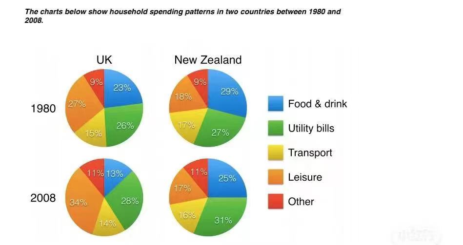
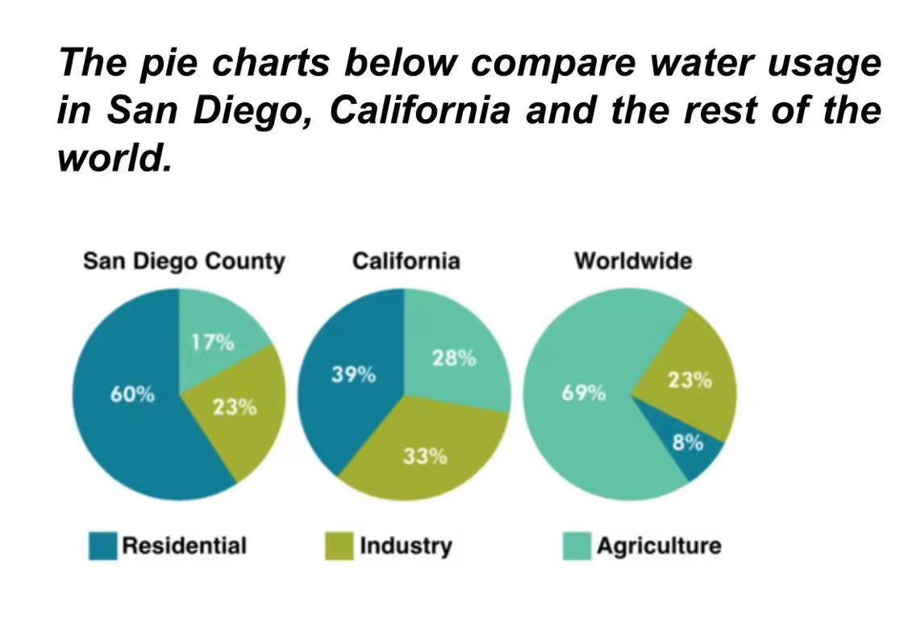
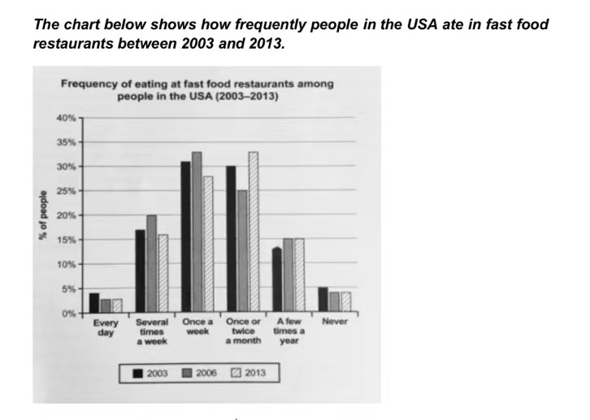
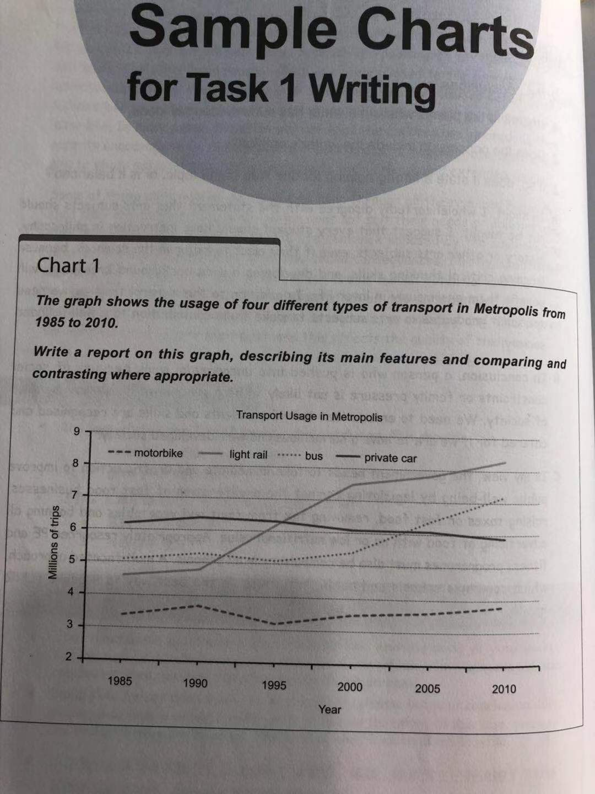

# 英语写作
1 aforg
2 beforg
3 catforg
4 deforg
5 exforg
6 forg
7 goforg
8 hyperforg
9 itforg
0 jetforg
eg: 12: aforg-beforg
    1: aforg
## 模版:
The **x** presents a comparison of **xx** in terms of **xxx** in **xxxx**.

The **x** presents an illustration of how **xx** changed over a period of **xxx** (**--**).
### 20221121 小1 pichart (aforg)

 The four pi charts present a comparison of **households** of two countries in terms of **their spending patterns on five categories** in two years (1980 & 2008).
 
 households = citizens
 ### 20221122 小2 pichart (beforg)
 
The three pi charts present a comparision of San Diego, California, and the rest of the world in terms of their water usage for three different purposes.

### 20221123 小3 barchart (catforg)

The bar chart presents an illustration of how **American** people's frequency of eating fastfood changed in three years.(2003,2006,2013)

### 20221124 小4 linechart (deforg)

The line chart presents an illustration of how the numbers of people used four types of transportation changed in Mstropolis over a period of 25 years(1985-2010).
