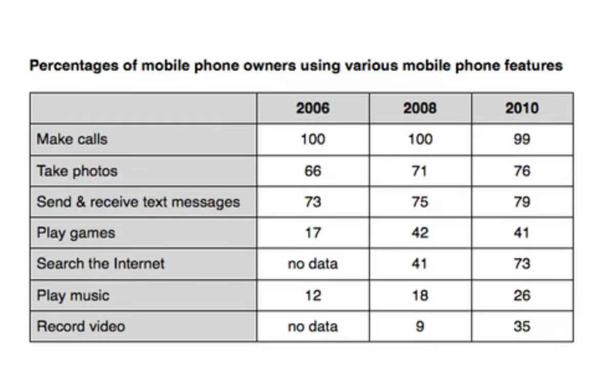
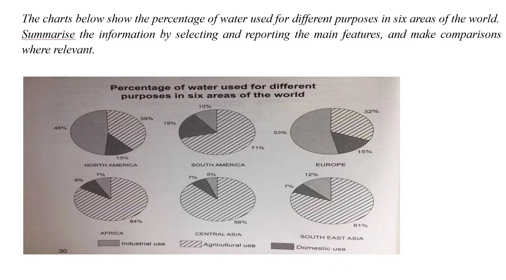
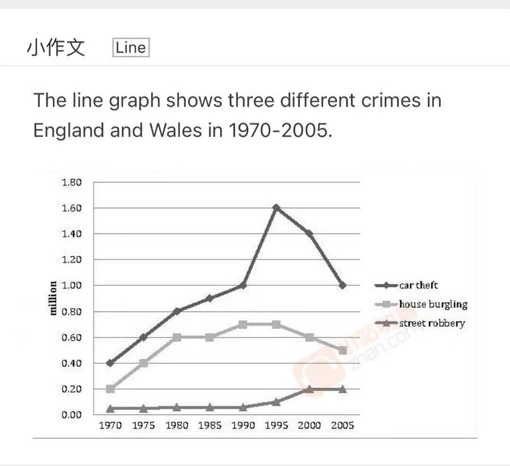
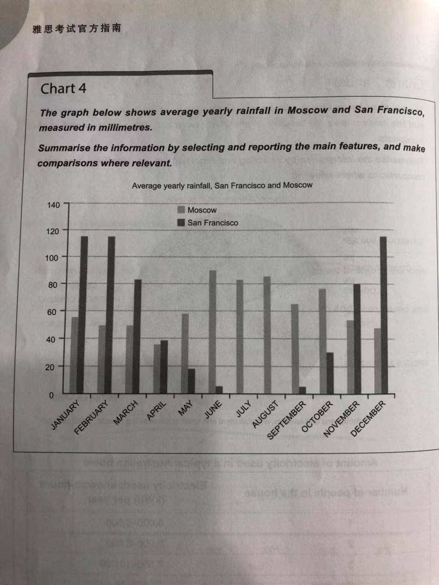

# 英语写作 2
## 模版:
The **x** presents a comparison of **xx** in terms of **xxx** in **xxxx**.

The **x** presents an illustration of how **xx** changed over a period of **xxx** (**--**).

## 小作文

The table presents a comparison of three different years in terms of the percentages of mobile phone owners using various phone features in 2006,2008 and 2010.

In general, make calls are still the main purpose of using mobile phone, while the number of people who playing games and seaching the internet had a significant increase in 2006-2010.

The pi chart presents a comparison of four areas in terms of the percentages of different purpose of using water.

Overall, most common form of water usage in these areas is Agricultural usage, while the main usage in North America & Europe is industrial purpose.The domestic use shows the significant difference than other 2 forms across 6 areas.

## 大作文

1.  Some people think adults should give children freedom to make mistakes. Others think adults should prevent children from making mistakes. Discuss both views and give your own opinion. 

2.  Some people think that schools should group their pupils according to their academic abilities. Others believe that young people with different abilities should be educated together. Discuss both views and give your own opinion.

3. Some people argue that they would have more choices if the number of TV channels increases, but others would think that it would lead to poor TV programs if the number of TV channels increases. Discuss both views and give your own opinion. 

4. Some think that cultural traditions will be destroyed when they are used as money-making machines aiming at tourists. Others believe it is the only way to save such traditions in the world today. Discuss both sides and give your own opinion.
